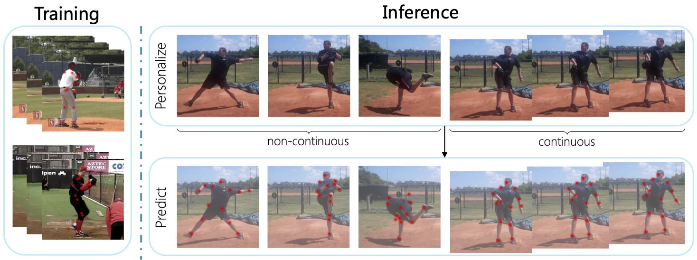

# Transforming Self-Supervision in Test Time for Personalizing Human Pose Estimation

This is an official implementation of the NeurIPS 2021 paper: [Transforming Self-Supervision in Test Time for Personalizing Human Pose Estimation](https://arxiv.org/abs/2107.02133). More details can be found at our [project website](https://liyz15.github.io/TTP/).

# 

## Preparation
1.  Install dependencies

   ```bash
   pip install -r requirements.txt
   ```

2. Make libs

   ```bash
   cd ${PROJECT_ROOT}/lib
   make
   ```

3. Place [Penn Action](http://dreamdragon.github.io/PennAction/) data in `data` directory. (Instructions on Human3.6M and BBC Pose are coming soon.)

   Your directory tree should look like this:
   ``` 
   ${PROJECT_ROOT}
   └── data
       └── Penn_Action
           ├── frames
           ├── labels
           ├── tools
           └── README
   ```

4. Download pretrained model of [ResNet-18](https://download.pytorch.org/models/resnet18-5c106cde.pth) and [ResNet-50](https://download.pytorch.org/models/resnet50-19c8e357.pth) and place them in `models/pytorch/imagenet`. 
   
   Your directory tree should look like this:
   ``` 
   ${PROJECT_ROOT}
   └── models
       └── pytorch
           └── imagenet
               ├── resnet18-5c106cde.pth
               └── resnet50-19c8e357.pth
   ```

## Training and Test-time Personalization

### Training

   ```bash
   python tools/train_joint.py \
      --cfg experiments/penn/joint_res50_128x128_1e-3_comb_attn_tf1_4head.yaml
   ```

### Run Test-Time Personalization (online)

   ```bash
   python tools/test_time_training.py \
      --cfg experiments/penn/ttp_res50_128x128_lr1e-4_online_downsample1_comb_attn_tf1_4head.yaml \
      TEST.MODEL_FILE ${MODEL_FILE}
   ```

### Run Test-Time Personalization (offline)

   ```bash
   python tools/test_time_training.py \
      --cfg experiments/penn/ttp_res50_128x128_lr1e-4_offline_downsample1_comb_attn_tf1_4head.yaml \
      TEST.MODEL_FILE ${MODEL_FILE}
   ```

### Baseline Model

To train the baseline model for comparison

   ```bash
   python tools/train.py --cfg experiments/penn/res50_128x128.yaml
   ```

## Result

Configs, results and model checkpoints on Human3.6M and BBC Pose are coming soon.

| Method   | TTP Scenario | Penn Action | Checkpoint   |
|----------|--------------|-------------|--------------|
| Baseline | -            | 85.233      | [Google Drive](https://drive.google.com/file/d/1zFeAsd2u1YgigSbOvFGrIVQzQ5Hv0J7R/view?usp=sharing) |
| Ours     | before TTP   | 86.283      | [Google Drive](https://drive.google.com/file/d/1vFB4_u21fA9qjQFReKvckTCyFL4K_yAi/view?usp=sharing) |
| Ours     | online       | 87.660      | -            |
| Ours     | offline      | 88.633      | -            |


## Acknowlegement

TTP is developed based on [HRNet](https://github.com/HRNet/deep-high-resolution-net.pytorch). We also incorperate some code from [IMM](https://github.com/tomasjakab/imm/).